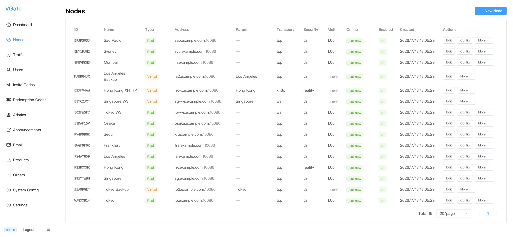
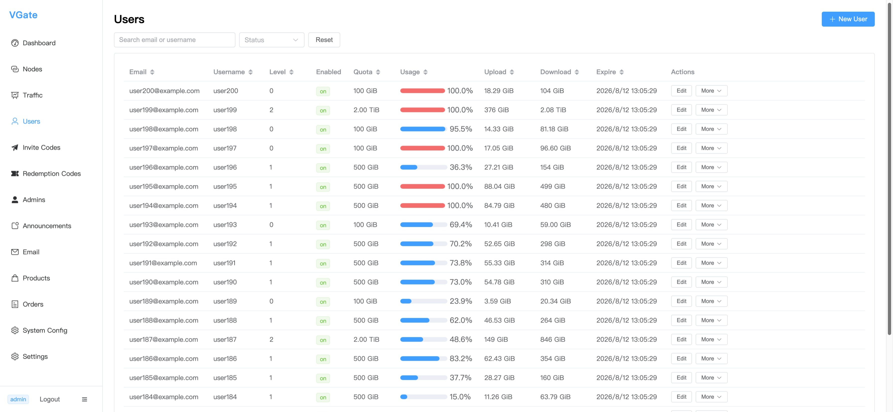
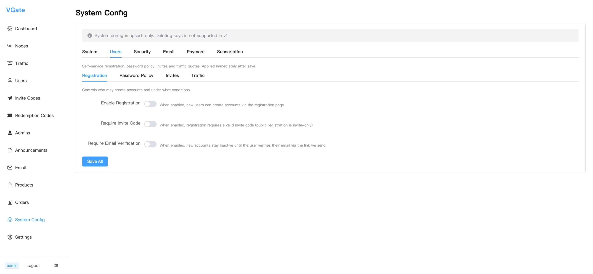

# Admin Console

`vgate-admin/` is the Vue 3 web UI operators use to run VGate day to day. It talks to the
manager's REST API under `/api/v1`.

Source: [github.com/vgate-project/vgate-admin](https://github.com/vgate-project/vgate-admin)

## Pre-built (no build)

The admin console is also published as a **ready-built SPA** in the
[vgate-admin releases](https://github.com/vgate-project/vgate-admin/releases). Download
`dist.tar.gz` / `dist.zip`, extract it into a `dist/` directory, then edit `dist/env.js` to set
`window.__ENV__.API_BASE_URL` to your manager's API origin (empty `''` for same-origin behind a
reverse proxy), and serve the folder statically. No `npm install` / `npm run build` required. See
[Releases (Pre-built)](/operations/releases) for the full steps.

## Stack

Vue 3 + Vite + TypeScript, with Element Plus, Pinia, Vue Router, and Axios. Node 18+ required.
Ships `package-lock.json`; use `npm`.

## Commands

```bash
cd vgate-admin
npm install
npm run dev        # Vite dev server → http://localhost:5173
npm run build      # production build → dist/
npm run preview    # preview the build
npm run typecheck  # vue-tsc --noEmit
```

::: info No test script
The frontend has **no test script** (only `dev`, `build`, `preview`, `typecheck`). There is
nothing to run with `npm test`.
:::

## What you can do

- **Nodes**: create/edit proxy nodes, set their listen port, transport (`tcp`/`ws`/`xhttp`),
  TLS/Reality security, and per-node upload/download speed limits — all delivered to the node via the manager.
- **Users**: create users, assign plans, revoke credentials, and set per-user speed limits.
- **Plans**: define purchasable plans (price, quota, duration) and per-plan speed caps. Gated to `super_admin`.
- **Orders**: view and manage billing orders.
- **Traffic**: inspect per-user and per-node usage and stats.
- **System config**: tune hot-reloadable settings (JWT TTLs, log level/format, CORS origins,
  timeouts) via `PUT /api/v1/admin/system-config`.
- **Announcements**: publish notices to the user portal.
- **Invites**: create and manage invite codes that gate or credit new registrations.
- **Redemption codes**: issue and track redemption codes that users apply from the portal's `/redeem` page.
- **Telegram**: link your own operator account for ticket notifications, broadcast messages to
  every linked user, and toggle announcement/alert forwarding (requires the manager's Telegram bot
  to be enabled).
- **Tickets**: list and view support tickets from users, reply to them, and move each through the
  `open → in_progress → resolved → closed` status machine; a later user reply reopens a closed
  ticket.

## Auth behavior

- The admin console uses **JWT access + refresh**. Login returns both tokens.
- On a `401`, the Axios interceptor performs **one automatic silent refresh**, then retries.

## API base URL

In dev, Vite proxies `/api` → `http://localhost:8081` (the manager) to avoid CORS.

At runtime the API base URL is read from `window.__ENV__.API_BASE_URL`, injected by
`public/env.js`. `public/env.js` is copied **verbatim** to `dist/env.js` and is **not** bundled,
so you can repoint the backend after deploy without rebuilding:

- Empty string → relative `/api/v1` (same-origin / reverse-proxy).
- Full URL → needed when the manager runs on a separate host; the manager's CORS
  `allowed_origins` must then allow the frontend origin.

## Deploying

Build with `npm run build` and serve `dist/` from any static host or your reverse proxy
alongside the manager. Edit `dist/env.js` to set `API_BASE_URL`.

## Screenshots

### Dashboard


*The admin dashboard at a glance: node count, active users (24h), traffic, orders paid, new users, expiring subscriptions, quota-exhausted and unverified counts, hourly upload/download traffic chart, and live node status table.*

### Nodes



*Node management table — each row shows ID, name, type (Real/Virtual), address, parent node, transport protocol, security mode (TLS/Reality), online status, and quick actions for editing config.*

### Users



*User list with per-user quota, real-time usage progress bar (red = exhausted), cumulative upload/download bytes, expiry date, and edit actions.*

### System Config



*System configuration panel (Users tab) — toggle self-service registration, require invite codes, and require email verification. All settings are DB-backed and applied immediately on save.*
