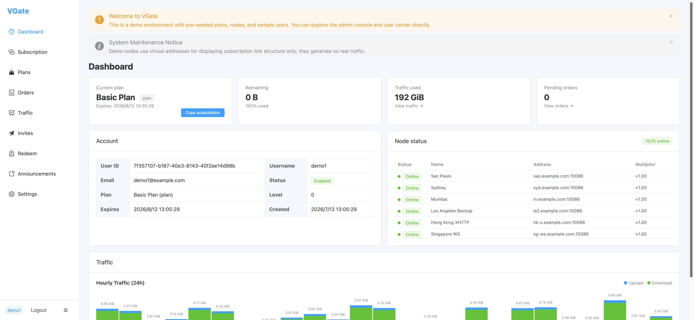
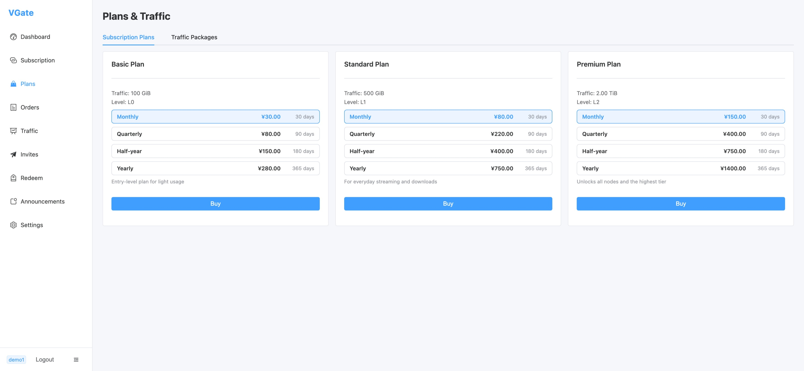
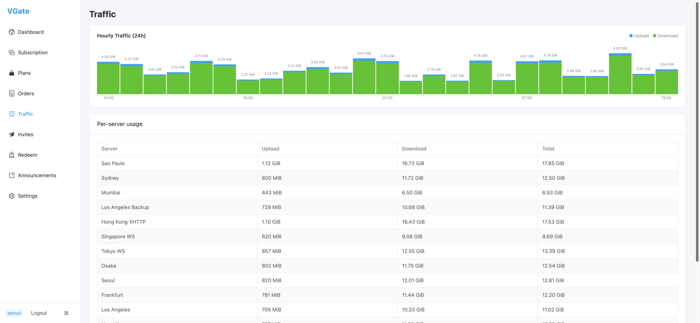

# User Portal

`vgate-user/` is the Vue 3 web UI your **customers** use: they log in, manage their profile,
subscribe to plans, and view their subscription and usage. It talks to the manager's REST API
under `/api/v1`.

Source: [github.com/vgate-project/vgate-user](https://github.com/vgate-project/vgate-user)

## Pre-built (no build)

The user portal is also published as a **ready-built SPA** in the
[vgate-user releases](https://github.com/vgate-project/vgate-user/releases). Download
`dist.tar.gz` / `dist.zip`, extract it into a `dist/` directory, then edit `dist/env.js` to set
`window.__ENV__.API_BASE_URL` to your manager's API origin (empty `''` for same-origin behind a
reverse proxy), and serve the folder statically. No `npm install` / `npm run build` required. See
[Releases (Pre-built)](/operations/releases) for the full steps.

## Stack

Vue 3 + Vite + TypeScript, with Element Plus, Pinia, Vue Router, and Axios. Node 18+ required.
Ships `package-lock.json`; use **`npm install`**.

## Commands

```bash
cd vgate-user
npm install
npm run dev        # Vite dev server → http://localhost:5174
npm run build      # production build → dist/
npm run preview    # preview the build
npm run typecheck  # vue-tsc --noEmit
```

::: info No test script
As with the admin console, there is **no test script** for the user frontend.
:::

## Differences from the admin console

- **No silent refresh.** User JWT access tokens are **not refreshable**. On a `401`, the Axios
  interceptor clears the token and redirects to `/login`.
- **Cloudflare Turnstile.** Login supports a `cf_turnstile_response` field for bot protection.
- **Email verification.** There is a `/verify-email` flow.

See `vgate-user/README.md` for the full route list and details.

## What users can do

- Log in / verify email.
- View their profile and current subscription.
- Browse plans and place orders.
- Copy their **subscription link** (`/sub/:sub_token`) into a VLESS client.
- View their traffic usage against their plan quota and their effective speed cap on the dashboard.
- **Telegram**: bind a personal Telegram account (Settings) for ticket notifications and toggle
  announcement delivery — only shown when the manager's Telegram bot is enabled and self-binding is
  allowed.
- **Support tickets**: open a ticket, reply to admins, and close their own ticket; when opening a
  ticket they choose how they're notified of replies (`none` / `email` / `telegram`, defaulting to
  `telegram` when their account is linked).

## API base URL

Same mechanism as the admin console: `window.__ENV__.API_BASE_URL` injected by `public/env.js`,
copied verbatim to `dist/env.js` (not bundled). Set it after deploy without rebuilding.

## Deploying

Build with `npm run build` and serve `dist/` from a static host or your reverse proxy. Ensure the
manager's CORS `allowed_origins` permits the portal's origin when the manager is on a separate
host.

## Screenshots

### Dashboard



*The user dashboard shows current plan (with expiry), remaining quota, total traffic used, pending orders, account details (user ID, email, username, status, plan level), live node status with online indicators, and an hourly upload/download traffic chart.*

### Plans & Traffic



*Subscription plans page — three tiers (Basic / Standard / Premium) with monthly, quarterly, half-yearly, and yearly pricing. Each tier specifies traffic allowance and access level.*

### Traffic Analytics



*Per-server traffic breakdown: hourly upload/download bar chart over 24 hours plus a table of per-node upload, download, and total usage.*
