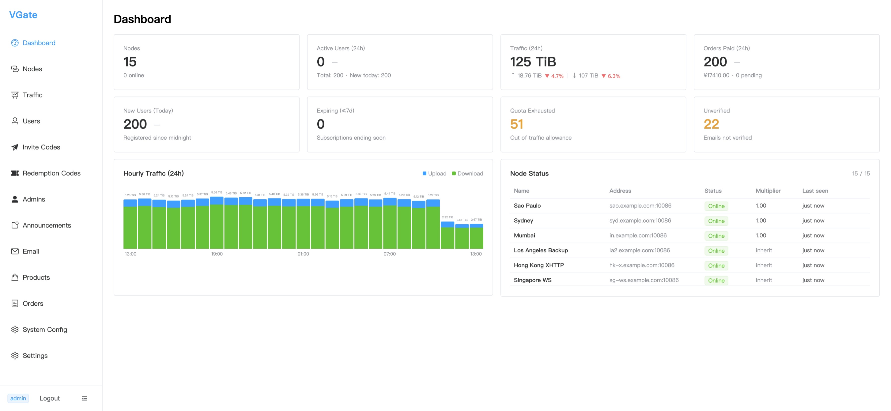

## Why VGate?

Running a proxy service means juggling many moving parts: boxes in different regions, rotating
user credentials, expiring subscriptions, and the constant question of *"who used how much
traffic?"*. VGate collapses all of that into one coherent system you host yourself.

- **One control plane.** The `manager` holds the canonical config; proxy `server` nodes are
  dumb and obedient — they pull, they serve, they report.
- **No vendor lock-in.** Everything is open source and self-hosted. Your nodes, your users,
  your data.
- **Operable by non-engineers.** The admin console hides the protocol plumbing behind forms
  and tables, so day-to-day operations don't require SSH access to every node.
- **Observable billing.** Traffic accounting and order management are first-class, not bolt-ons.

## How it fits together

```text
                         ┌─────────────────────────┐
      Admin operator --> │   Admin Console (Vue)   │
                         └───────────┬─────────────┘
                                     │  REST /api/v1
                         ┌───────────▼──────────────┐
   Users (portal/apps) ->│      Manager (backend)   │◄-- Node token auth
                         │  API · Auth · Billing    │        per-user traffic
                         │  Plans · Traffic · Nodes │            reports
                         └───────────┬──────────────┘
                                     │  REST /api/v1/server/*
                         ┌───────────▼──────────────┐
      Internet clients ->│  Server (VLESS inbound)  │
                         │  TCP · WS · xhttp · VLESS│
                         └──────────────────────────┘
```

## Gallery

### Admin Console



*The operator's dashboard: live node status, traffic stats, and hourly usage chart — all in one view.*

[See more admin console screenshots →](/components/admin-console)

### User Portal


*The customer portal: current plan, quota remaining, account info, node availability, and personal traffic analytics.*

[See more user portal screenshots →](/components/user-portal)

## What people use it for

- **Service providers** selling access to a fleet of proxy nodes with paid plans.
- **Teams** who need a single place to issue credentials and track usage.
- **Hobbyists** who run a handful of nodes and want a clean admin UI instead of shell scripts.

## Start in minutes

```bash
# 1. Clone + start the manager (auto-migrates the DB and prints the admin password once)
git clone https://github.com/vgate-project/vgate-manager.git
cd vgate-manager && go build -o vgate-manager . && ./vgate-manager --config config.yml

# 2. Point a proxy node at it (its own repo)
git clone https://github.com/vgate-project/vgate-server.git
cd vgate-server && go build -o vgate . && ./vgate --config config.yml

# 3. Open the admin console and create your first node + user
```

::: tip Don't want to build from source?
Every component is also published as a **pre-built artifact** — binaries, Docker images, and the
built frontends — in its [GitHub release](https://github.com/vgate-project). Download, run, and
point the frontends at your manager via `env.js` (no build step). See
[Releases (Pre-built)](/operations/releases).
:::

::: tip New here?
Read [What is VGate?](/guide/what-is-vgate) for the big picture, then jump to
[Quick Start](/guide/getting-started).
:::

## License

VGate is released under the [GNU Affero General Public License v3.0 (AGPL-3.0)](https://www.gnu.org/licenses/agpl-3.0.html).
